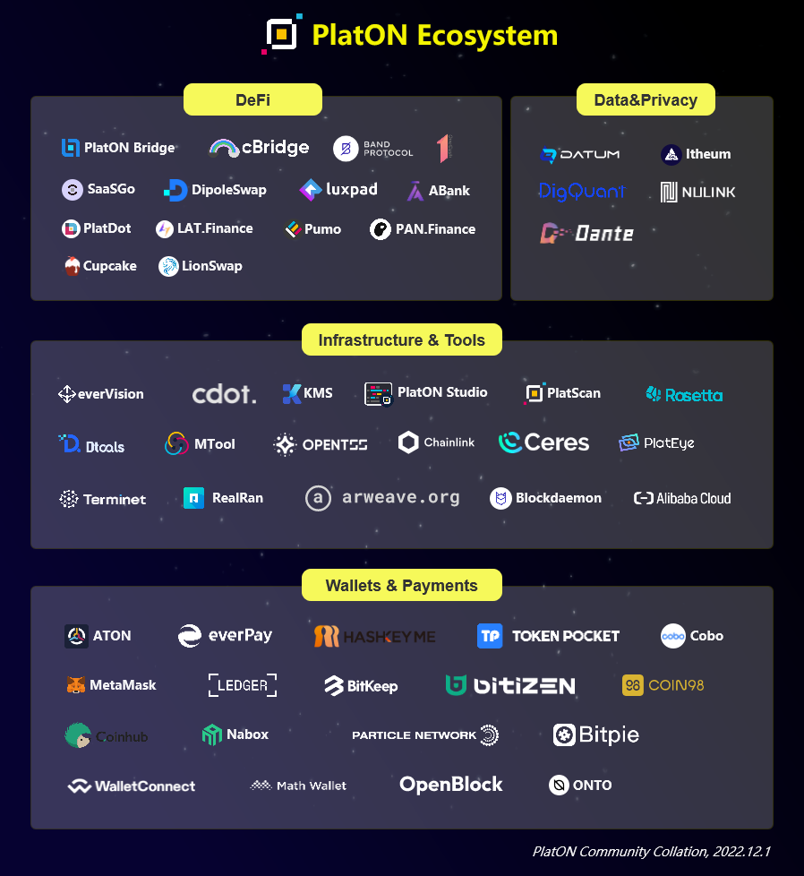
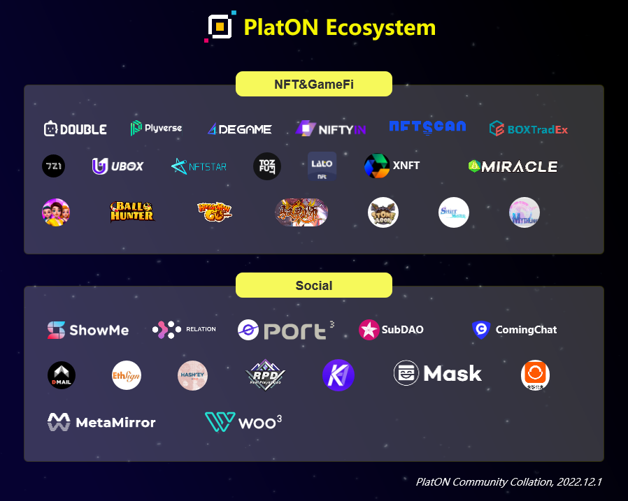

## PlatON Developer Library - Web3 Global Startup Competition

This document will serve as your guide to the PlatON ecosystem. You will find links to some useful resources and websites to get you started building on PlatON quickly. Please feel free to contact us with any questions you may have.

### [Website](https://www.platon.network/en) | [Twitter](https://twitter.com/PlatON_Network) | [Discord](https://discord.gg/jAjFzJ3Cff) | [Telegarm](https://t.me/PlatONNetwork) | [Forum](https://forum.latticex.foundation/c/PlatON-EN)

## About PlatON

PlatON was initiated and promoted by the LatticeX Foundation. Based on the basic properties of the blockchain and supported by a privacy-preserving computing network, PlatON provides the next-generation Internet basic protocol featuring “computing interoperability”. It builds a computing system jointly assembled by cryptographic algorithms such as verifiable computing, secure multi-party computing, zero-knowledge proof, homomorphic encryption, and blockchain technology to provide public infrastructure under an open-source architecture for global artificial intelligence, distributed application developers, data providers as well as various institutions, communities, and individuals with computing needs.

**Learn more:**

[PlatON Whitepaper2.0—Decentralized Privacy-Preserving AI Network](https://www.platon.network/pdf/en/PlatON_A_High-Efficiency_Trustless_Computing_Network_Whitepaper_EN_2.pdf)

[PlatON Technology —PlatON computing infrastructure architecture](https://devdocs.platon.network/docs/en/PlatON_Overall_Solution/)

## PlatON Documentation & Developer Resources

**PlatON Documentation - Overview** 

https://devdocs.platon.network/docs/en/

**PlatON Development guide**

Build your web3 app on PlatON

https://devdocs.platon.network/docs/en/PlatON_Overview_DevGuide

**PlatON Blockchain Explorer**

Allow you to explorer and search the PlatON  blockchain for transactions, addresses, tokens and other on-chain activity.

- PlatON Mainnet Explorer: https://scan.platon.network/
- PlatON Devnet2 Explorer - For development testing: https://devnet2scan.platon.network

**PlatON Devnet2 Faucet**

https://devnet2faucet.platon.network/faucet

**PlatON Wallet**

- ATON Wallet: https://www.platon.network/en/wallet
- MetaMask-Configure the PlatON Network using MetaMask:  https://devdocs.platon.network/docs/en/MetaMask

**Contract Development Tools**

PlatON Studio - Graphical IDE to help easily deploy smart contracts and DApps on PlatON.

https://github.com/ObsidianLabs/PlatON-Studio/

**PlatON SDK References**

[Python SDK,](https://devdocs.platon.network/docs/en/Python_SDK) [JS SDK](https://devdocs.platon.network/docs/en/JS_SDK), [Java SDK](https://devdocs.platon.network/docs/en/Java_SDK), [Explorer API](https://devdocs.platon.network/docs/en/Explorer_API), [Go SDK](https://devdocs.platon.network/docs/en/Go_SDK), [.NET SDK](https://devdocs.platon.network/docs/en/NET_SDK), [JSON RPC](https://devdocs.platon.network/docs/en/Json_Rpc), [GraphQL Server](https://devdocs.platon.network/docs/en/GraphQL_Server)

## RPC Endpoints and Node Deployment

**Connect to the PlatON Devnet2**

Introducing how to debug local applications by connecting to PlatON Devnet2

https://devdocs.platon.network/docs/en/Join_Dev_Network

**Build PlatON local Private Network**

https://devdocs.platon.network/docs/en/Build_Private_Chain/

**PlatON Mainnet RPC Endpoints**

> Network Name: PlatON MainNetwork
>
> RPC URL: https://openapi2.platon.network/rpc
>
> Chain ID：210425
>
> Currency Symbol：LAT
>
> Block Explorer URL: https://scan.platon.network/

**Network Name: PlatON Dev2 Network**

> RPC URL: https://devnet2openapi.platon.network/rpc   or  wss://devnet2openapi.platon.network/ws
>
> Chain ID：2206132
>
> Currency Symbol：LAT
>
> Block Explorer URL: https://devnet2scan.platon.network/

## Developer Tutorials

> PlatON is already compatible with ethereum EVM, and you can develop on the PlatON network based on existing ethereum tools and tutorials.

**PRC721 NFT Release Tutorial**

Learn how to publish NFT on the PlatON DevNet with this tutorial

https://devdocs.platon.network/docs/en/qianqian_prc721_tutorial/

**Solidity Smart Contract Development Tutorial Based on PlatON**

https://devdocs.platon.network/docs/en/Solidity_Dev_Manual

**Wasm Smart Contract Development Tutorial Based on PlatON**

https://devdocs.platon.network/docs/en/Wasm_Dev_Manual

## PlatON Ecosystem

PlatON Ecosystem

https://www.platon.network/en/ecosystem

## PlatON Idea Bank

For more inspiration, check out the [PlatON Hackathon Ideas Bank](https://github.com/PlatONnetwork/2023-Web3-Global-Startup-Competition/blob/main/Developer_Library/PlatON_Hackathon_Ideas_Bank.md) .

One way to implement a hackathon idea is to look at projects already deployed on the mainnet and build a new application based on them with unique features and solving real-world problems.

## Grants support

Foundation Grant Program- designed to help development teams realize their ideas

https://latticex.foundation/grants

## Meet PlatON Community

- **Join the PlatON Discord Server**

  Check out the PlatON community on Discord - hang out with xx other members and enjoy free voice and text

  https://discord.gg/jAjFzJ3Cff

- **Join the PlatON Forum**

  Share your ideas and participate in discussions, get PlatON's latest announcements & event news

  https://forum.latticex.foundation/

- **PlatON Ambassador Program**

  PlatON Ambassadors are the closest members of the PlatON community who help PlatON advance the mission of developing PlatON. If you believe in PlatON and want to help promote it, please join us~

  https://forum.latticex.foundation/t/topic/4246

  https://forum.latticex.foundation/t/topic/5925

