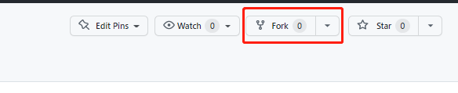
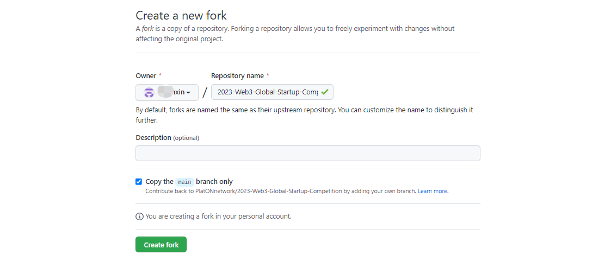
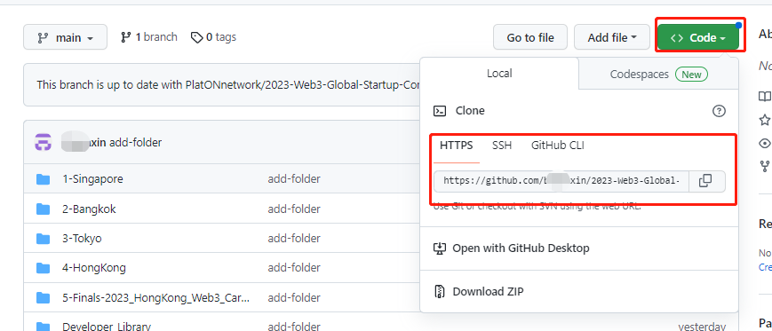
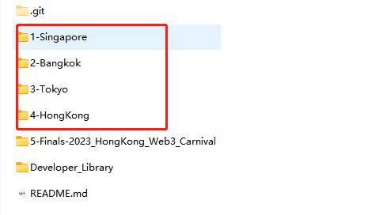
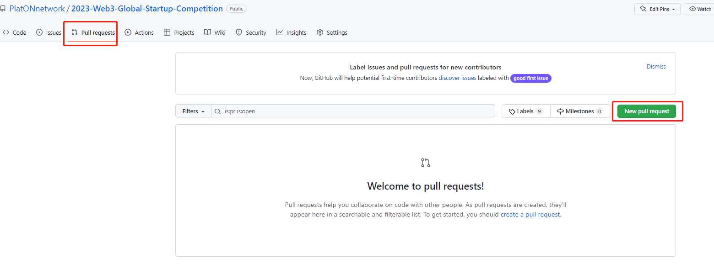

# Project Submission Guidelines


Thanks for joining the 2023 Web3 Global Startup Competition!

The competition features four divisions, and you are required to submit your project before the deadline for the corresponding division.

These guidelines will teach you how to submit your project to the GitHub repository  (**[2023-Web3-Global-Startup-Competition](https://github.com/PlatONnetwork/2023-Web3-Global-Startup-Competition)**) corresponding to the relevant division.


## Submission Process


1. Enter the official  [GitHub](https://github.com/PlatONnetwork/2023-Web3-Global-Startup-Competition) - `PlatONnetwork/2023-Web3-Global-Startup-Competition` repository of the competition.

   

2. Select "**Fork**" to copy the official repository to your personal GitHub repository;

   Note: "Fork" means creating a personal copy of the repository. You can make any changes on the personal copy and submit those changes to the original repository, and the admin will review and merge your changes.

   

   

   

3. Clone the copy of the Forked repository to your device;

   ```
   git clone https://github.com/YOUR_USERNAME/2023-Web3-Global-Startup-Competition.git
   ```

   


4. Arrange the files on your own device: First, create a personal project folder (take the name of your corresponding project) under the division folder, and place the files to be submitted in the personal folder.

   | More ActionsFiles to be submitted                            |
   | ------------------------------------------------------------ |
   | Files to be submitted）                                      |
   | PowerPoint demo (required)                                   |
   | DEMO link or link to the project introduction video (optional; the video should be uploaded to video platforms like YouTube and may not exceed 5 minutes) |
   | Any other support material                                   |

   

   

   

5. Push the changed branch to the remote branch under your Github account;

   ```
   git add .
   git commit -m "Project Name Results Delivery"
   git push
   ```

   

6. Submit a copy of the changes to the official repository through PR (Pull Request) and fill in the required submission information. The specific process is as follows:

   - Enter the official repository.

   - Select [Pull requests].

   - Click on "New pull request".

   - Click on “compare across forks”, and select your repository on the drop-down list of the main repository.

   - Fill in your submission notes for the Pull Request.

     > Here's how you should name the PR: division-team name-project name-team members




**If you have any question, please look for help via the Competition's [Discord](https://discord.gg/KHmAj99fdE) channel!**

