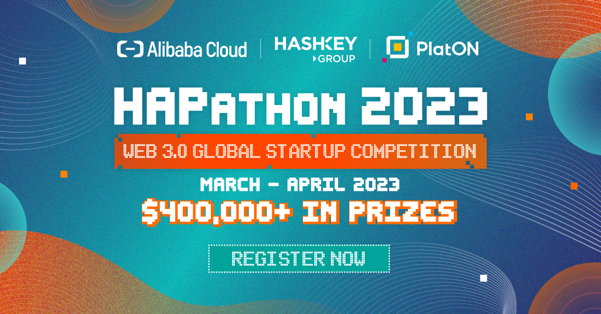

# 2023 Web3 Global Startup Competition

 

Amidst the ongoing Web3 boom, we have seen plenty of exciting tech innovations and new applications. Aiming to give data ownership back to users, Web3 strives to build a new era of the Internet by sharing benefits with all users and encouraging joint contributions. Web3 provides a broad space for young talents with innovative ideas to fully unlock their potential.

Focusing on the most prominent demands of the Web3 industry, the 2023 Web3 Global Startup Competition consists of three categories, including **Technical Infrastructure**, **Financial Infrastructure**, and **Innovative Web3 Application**. We are inviting outstanding developers from around the world to co-build the Web3 ecosystem with creative ideas and innovative projects.

 

## About the Event

The 2023 Web3 Global Startup Competition is co-hosted by Alibaba Cloud, PlatON, and HashKey Group.

The competition features four global divisions: **Singapore**, **Bangkok**, **Tokyo**, and **Hong Kong, China**, and contestants may choose the division nearest to them. All award-winning teams from each division will gather at the **2023 Hong Kong Web3 Festival** to present their projects. We believe that the teams will add to the Carnival's splendor with their creative, valuable projects and bring outstanding talents to Hong Kong's Web3 community.

### Topic-Web3 Innovation

**Financial infrastructure**

Financial infrastructure provides essential support for the financial system of the Web3 world. You are required to develop secure, efficient, and creative projects based on blockchain and related technologies, thereby contributing to the sustainable development of the Web3 financial ecosystem. 

**Technical Infrastructure**

We invite outstanding developers around the world to explore underlying technologies in fields including Layer 2, decentralized data storage, computation, indexing, analysis, smart contracts, developer tools, and blockchain security and build creative, practical solutions. 

**Innovative Web3 Application**

Focusing on popular Web3 applications, we will invite outstanding developers around the world to tap into their ingenuity and build creative applications(e.g. Innovative Dapp, NFT, Game-Fi, Social-Fi, etc.)  to improve user experiences and bring more dynamics to the Web3 world. Contestants can build native Web2 applications or transform Web3 apps into more valuable Web3 apps using the tech features of blockchain. 

### Applications Open in

 **January 2023**

### Schedule

#### Stop 1: Singapore

Duration: **March 18, 2023 - March 19, 2023**

Application deadline: **March 12, 2023**

[Learn more](/1-Singapore/)

 

#### Stop 2: Bangkok

Duration: **March 25, 2023 - March 26, 2023**

Application deadline: **March 19, 2023**

[Learn more](/2-Bangkok/)

 

#### Stop 3: Tokyo

Duration: **April 1, 2023 - April 2, 2023**

Application deadline: **March 26, 2023**

[Learn more](/3-Tokyo/)

 

#### Stop 4: Hong Kong

Duration: **April 8, 2023 - April 9, 2023**

Application deadline: **April 2, 2023**

 [Learn more](/4-HongKong/)

 

#### Grand Finals  - 2023 Hong Kong Web3 Festival 

Award-winning teams from all four divisions will gather in Hong Kong for the grand finals and award ceremony on the last day of the 2023 Hong Kong Web3 Festival.

The finals will be hosted on **April 15, 2023**

 [Learn more](/5-Finals)

 

## How to Participate

### Step 1: Getting prepared

Please carefully read the rules of the competition, select the division and category you wish to join, and choose the Web3 protocol to implement your innovative solutions.

 

### Step 2: Application

Please select the division and category you prefer, build your solution according to the selected topic, and submit your application before the deadline.

#### a. Application Gateway

**For individuals and teams:** https://survey.aliyun.com/apps/zhiliao/eKb7XOFAJ

#### **b. Application Deadline**

Singapore: **March 12, 2023**

Bangkok: **March 19, 2023**

Tokyo: **March 26, 2023**

Hong Kong: **April 2, 2023**

#### c. Application Review

- After applications end, we will screen all applicants and send confirmation emails to the qualified applicants starting from February 15.
- How to join the participant channel?
  Once your application becomes successful, we will whitelist the address(es) you provided in the registration form to claim the special credential in the form of a non-transferrable NFT, that will give you access to the exclusive participant channel on our discord community.
- Individual contestants need to team up with contestants in the designated Discord channel ([Discord](https://discord.gg/KHmAj99fdE)) and submit the team information (the application form to be updated) before the specified deadline, failing which the contestant's qualification will be annulled.
- Contestants who pass the screening will be invited to join our official Discord and TG groups, and the  subsequent arrangements and notices will be announced in the groups.
- When submitting your application, be sure to provide the required information, and applications with clear information regarding the background, value, and implementation of the project will be preferred.
- All applications are free of charge.

### Step 3: Competition 

Once your application is approved, you should get started with project development as soon as possible and attend the competition according to the timetable of the relevant division.

**Timetables:**

Singapore: **March 18, 2023 - March 19, 2023**

Bangkok: **March 25, 2023 - March 26, 2023**

Tokyo: **April 1, 2023 - April 2, 2023**

Hong Kong: **April 8, 2023 - April 9, 2023**

>  **Developer library of the competition's official partner:**
>
> - [PlatON Developer Library](/Developer_Library/PlatON_Developer_Library.md)
>

 

### Step 4: Submit Your Project

Please submit your project before the deadline.

**Submission requirements are as follows:**

a. You are required to submit the following:

- **Code link (required; the original code is stored in your personal GitHub repository and is not required for submission)** 
- **PowerPoint demo (required)**
- **DEMO link or link to the project introduction video (optional; the video should be uploaded to video platforms like YouTube and may not exceed 5 minutes)** 
- **Any other support materials**   

b. You are required to place the above files in your personal project folder (note: please change the name of the folder to your project name) under the relevant division folder of the official GitHub repository. [Click here to check out the Submission Guidelines](/Developer_Library/Project_Submission_Guidelines.md).

*Note: If you don't wish to publicly disclose your PowerPoint presentation, you may also send the files to our official mailbox.*

https://github.com/PlatONnetwork/2023-Web3-Global-Startup-Competition

c. The submission deadline is subject to the timetable of the divisions, and you may not submit or modify your project after the deadline.

 

### Notes

a. Contestants can choose to present their project online or offline, but all award-winning teams must attend the award ceremony in Hong Kong, otherwise they are considered to have forfeited their qualifications for the finals awards;

b. Each team can only have 2-6 members;

c. The competition only accepts projects that have not conducted any fundraising campaigns;

d. The competition encourages innovative projects and ideas, and the workload during the competition will be one of the major evaluation metrics;

f. Contestants need to bear travel expenses; the competition venue will be open to all teams on a 24-hour basis during the event. Contestants may bring sleeping bags and tents to the venue;

e. During the competition, we will provide free meals, snacks, and drinks for all contestants.

## Project Review

The review committee will consist of representatives from the sponsor, community KOLs, ambassadors, professionals, senior members of tech communities & university professors, and representatives from VC funds and mainstream blockchain networks. For more information about the judges, please roll down to the bottom of the document.

The review committee will score the entries and select the award winners based on the following metrics.

| Evaluation metrics                              | Score  |
| :---------------------------------------------- | :----- |
| Feasibility (25%)                               | 15     |
| Completeness (16.66%)                           | 10     |
| Social value (16.66%)                           | 10     |
| Source code (16.66%)                            | 10     |
| Project presentation (8.34%)                    | 5      |
| Compatibility with PlatON (8.34%)               | 5      |
| Whether based on Alibaba Cloud services (8.34%) | 5      |
| **Total**                                       | **60** |

## Awards

### Prize Pool: 200,000 USDC

 

#### Grand Finals

##### Grand Champion *1

**20,000 USDC**

The team that receives the most votes during the 2023 Hong Kong Web3 Festival will be the World Champion.

#### Singapore, Bangkok, Tokyo, and Hong Kong(three awards for each division)

##### **1st Place Award  * 1**

- 15,000 USDC
- A 10-min speaking slot at the sub-stage of the 2023 Hong Kong Web3 Festival
- 6 tickets to the 2023 Hong Kong Web3 Festival
- A $10,000 Alibaba Cloud voucher (valid for one year)
- Travel subsidy (3,000 USDC,Exclude Team Hong Kong)

##### **2nd Place Award  * 1**

- 10,000 USDC

- 6 tickets to the 2023 Hong Kong Web3 Festival

- A $10,000 Alibaba Cloud voucher (valid for one year)

  

##### **3rd Place Award  * 1**

- 5,000 USDC
- 6 tickets to the 2023 Hong Kong Web3 Festival
- A $10,000 Alibaba Cloud voucher (valid for one year)

**Every team that has passed the review and is shortlisted can apply for a $1,000 Alibaba Cloud voucher for event preparation**. 

#### Special Awards

- **Web3 Middleware Service Award (15,000 USDC)）**

  The award will be given to the best project for promoting the development of innovative Web3 tools and platforms by providing professional services for global developers in fields covering middleware and developer toolkits.

- **Security bug bounty (15,000 USDC)**

  An incentive for submitting effective bug reports on Alibaba Cloud's Nodeapi service.
  
- **DID applicability and compatibility (15,000 USDC)**

  The award will be given to the best DeFi project (dex lending) that requires KYC and uses DID or the best DID-based socialFi project, such as a lens-based Dapp
  
  

#### Incentives from Partner Organizations
- Reward university organizations such as the University Blockchain Association and other partners who assist in recruiting teams.

#### Sponsor Rewards

- All award-winning teams in the four divisions will receive a **$10,000** Alibaba Cloud voucher (valid for one year).
- All participating teams can apply for a **$1,000** Alibaba Cloud voucher.

 

>  Moreover, outstanding teams will get opportunities for project incubation, acceleration, and implementation!

## Notice for All Contestants

- We promise to protect the  privacy of all contestants and will not share the information you provided with third parties without your consent. Your information will be used for sending you important notifications related to the competition.
- Contestants must provide true, valid, and legal information as required and authorize the organizer and its affiliates to use or allow a third party to use personal information such as name and portrait for promotion and other non-profit activities.
- The content submitted or published by contestants shall conform to laws and regulations and the rules of the competition. We shall have the right to review the content submitted or published by contestants. Any content violating the relevant laws and regulations or rules will be dealt with accordingly, and we will not be liable for any consequences or losses arising therefrom.
- Contestants must submit original works only, and the data used should be available from public sources. The content submitted or published by contestants shall not infringe upon the legitimate rights and interests of third parties, such as privacy, business secrets, and intellectual property rights. Once any act of fraud, plagiarism, or infringement is discovered and confirmed, we will cancel the qualifications and awards of the contestants liable.
- Contestants shall own the intellectual property rights of the works they created during the competition. Contestants shall agree to grant the organizer and its affiliates the right to use  or allow third parties to use such works permanently and free of charge for promotions and other non-profit activities anywhere around the world.
- Contestants shall bear the obligation of confidentiality pertaining to the confidential information of the competition and may not disclose or disseminate the said information without the permission of the organizer.
- Contestants may not advertise and/or otherwise engage in marketing campaigns for any product or service during the competition.
- Organizations or individuals may not conduct promotions or business activities in the name of the competition, the organizer, and its affiliated entities, without the authorization of the organizer. In the event of any infringements such as unauthorized use, we shall hold the culprit legally liable.
- Contestants shall abide by the relevant laws and regulations and the policies stipulated by their schools or employers. Contestants must carefully read and conform to the rules of the competition and these notices, failing which the contestant(s) will be held liable, and their qualifications and awards might be annulled.
- Where any unexpected event affects the normal process of the competition, the organizer shall have the right to cancel or alter the relevant matters or rules. We reserve the right to the final interpretation of the competition and its rules.

 

## Organizers

### **About Alibaba Cloud**

Established in 2009, Alibaba Cloud (www.alibabacloud.com) is the digital technology and intelligence backbone of Alibaba Group. It offers a complete suite of cloud services to customers worldwide, including elastic computing, database, storage, network virtualization services, large-scale computing, security, management and application services, big data analytics, a machine learning platform and IoT services. Alibaba maintained its position as the third leading public cloud IaaS service provider globally since 2018, according to IDC. Alibaba is the world’s third leading and Asia Pacific’s leading IaaS provider by revenue in U.S. dollars since 2018, according to Gartner.

### **About HashKey Group**

HashKey Group is an end-to-end digital asset financial services group in Asia. The Group provides a complete ecosystem across the entire digital asset landscape, ranging from trading, custody, venture investment, technologies to Web3 infrastructure. HashKey’s senior team has decades of investment and trading experience, strong business execution and deep market insights gained from tier-one banks, regulators and FinTech ventures. By bringing together the most advanced blockchain research and development and technologies, HashKey identifies potential opportunities and delivers end-to-end solutions that operate within regulatory frameworks with the highest compliance standards. The Group has operations in Hong Kong, Singapore and Japan, and extensive partnerships with FinTech and blockchain solutions providers, academic institutions and associations.

 

### About PlatON

PlatON was initiated and promoted by the LatticeX Foundation. Based on the basic properties of the blockchain and supported by a privacy-preserving computing network, PlatON provides the next-generation Internet basic protocol featuring “computing interoperability”. It builds a computing system jointly assembled by cryptographic algorithms such as verifiable computing, secure multi-party computing, zero-knowledge proof, homomorphic encryption, and blockchain technology to provide public infrastructure under an open-source architecture for global artificial intelligence, distributed application developers, data providers as well as various institutions, communities, and individuals with computing needs.

 

 

 

---

*Code License: The MIT License (MIT)*
